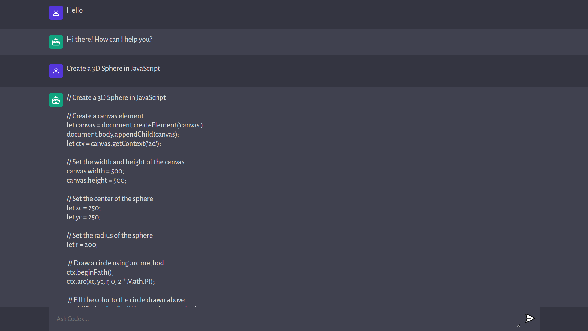

CodeX : AI Code Generator
=======================

[Live Website](https://utkarsh-codex.vercel.app/)  

CodeX is an innovative project that leverages the power of AI to simplify code generation and enhance the user experience. Built using the ChatGPT OpenAI API and JavaScript, it harnesses the capabilities of GPT-3 (Generative Pretrained Transformer 3), an advanced language processing AI model developed by OpenAI.  

With CodeX, you can effortlessly generate code snippets and receive answers to your coding-related questions, making it a valuable tool for developers, programmers and anyone seeking efficient code solutions. Whether you're looking to automate repetitive coding tasks or gain insights into complex programming challenges, CodeX has you covered.  

GPT-3's human-like text generation abilities open up a world of possibilities, from language translation and modeling to the creation of text for chatbots and other applications. CodeX represents a fusion of cutting-edge AI technology and practical coding solutions, revolutionizing the way we approach software development. Explore its potential and unlock the benefits of AI-driven code generation with CodeX.  

  
